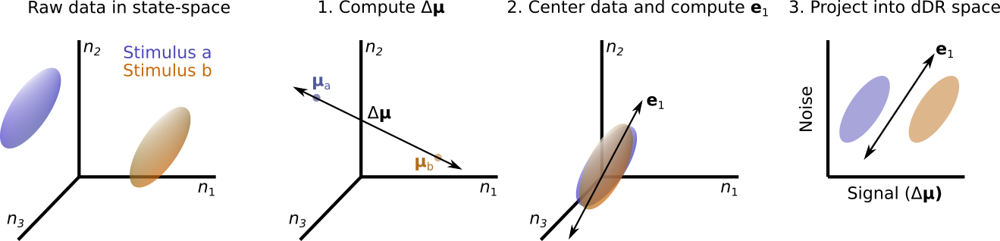

# decoding-based Dimensionality Reduction (dDR)

dDR is a linear dimensionality reduction for performing neural decoding from neural populations in cases where experimental data is limited. That is, casese where the number of neurons exceeds the number of observations (e.g. stimulus repetitions). dDR takes advantage of the fact that high-dimensional neural population data often exhibits low-dimensional dynamics. These low-dimensional activity patterns can be measured reliably, even when experimental repetitions are limited, and can therefore be leveraged to reliably measure decoding accuracy of both sensory stimuli and/or behavior. 

## Using dDR
