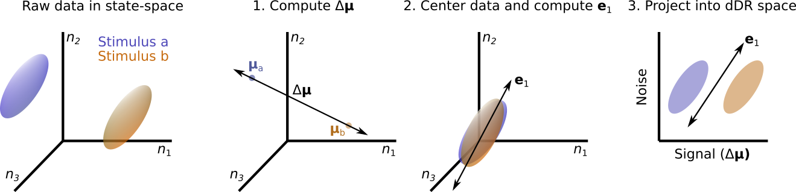

# decoding-based Dimensionality Reduction (dDR)

dDR is a linear dimensionality reduction method for performing decoding analyses using neural population data in cases where the experimental data is limited. That is, cases where the number of neurons exceeds the number of observations (e.g. stimulus repetitions). dDR takes advantage of the fact that high-dimensional neural population data often exhibits low-dimensional, stimulus-independent dynamics. These low-dimensional activity patterns can be measured reliably, even when experimental repetitions are limited. Therefore, they can be leveraged to reliably measure decoding accuracy of both sensory stimuli and/or behavior. The process for performing dDR is explained graphically below. For more details on dDR, see our manuscript (https://journals.plos.org/plosone/article?id=10.1371/journal.pone.0271136).



## Installing
#### Install base package only
The base package, without extra dependencies, can be installed directly from github as follows. Installation requires python version `>=3.8.3`
```
pip install git+https://github.com/crheller/dDR.git
```

#### Install editable version with manuscript figure dependencies:
Alternatively, you can install the editable version of the code, including the dependencies to run the figure scripts.
```
git clone https://github.com/crheller/dDR.git
cd /path/to/dDR
pip install -e .[extras]
```
or:
```
git clone git@github.com:crheller/dDR.git
cd /path/to/dDR
pip install -e .[extras]
```
To leave off extra dependencies, after cloning and switching into `dDR` directory, just use:
```
pip install -e .
```

## Using dDR
For an introduction on using the dDR class for neural decoding, please see the included demo ipython notebook, `dDR_demo.ipynb` (also available as an  `html` file for viewing only)
